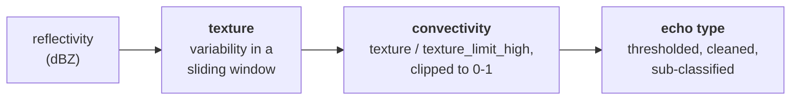

# EccoPy

Data-agnostic Python implementation of **ECCO** (Echo Classification from
COnvectivity), which separates convective from stratiform radar echo.

EccoPy operates purely on NumPy arrays. It never reads or writes files and
makes no assumption about coordinate system, file format, or radar type: you
supply reflectivity plus coordinate or spacing arrays, and get back
classification arrays of the same shape.

```python
from eccopy import eccopy3d
from eccopy.params import WindowSpec

result = eccopy3d.run(dbz, coords_z=z_km, coords_y=y_km, coords_x=x_km,
                      height=height_km, temp=temp_c,
                      window=WindowSpec((7, "km")))

result.echo_type      # classification codes, same shape as dbz
result.convectivity   # 0-1 continuous score
result.texture        # reflectivity variability
```

## Algorithm references

Dixon, M. J., and U. Romatschke, 2022: *Three-Dimensional
Convective-Stratiform Echo-Type Classification and Convectivity Retrieval
from Radar Reflectivity.* J. Atmos. Oceanic Technol., **39**, 11.
[doi:10.1175/JTECH-D-22-0018.1](https://doi.org/10.1175/JTECH-D-22-0018.1)

Romatschke, U., and M. J. Dixon, 2022: *Vertically Resolved
Convective-Stratiform Echo-Type Identification and Convectivity Retrieval
for Vertically Pointing Radars.* J. Atmos. Oceanic Technol., **39**, 11,
1705-1716.
[doi:10.1175/JTECH-D-22-0019.1](https://doi.org/10.1175/JTECH-D-22-0019.1)

Reference implementations, which EccoPy ports:
[NCAR/lrose-ecco](https://github.com/NCAR/lrose-ecco) (MATLAB ECCO-V) and
[NCAR/lrose-core](https://github.com/NCAR/lrose-core) (C++ ConvStratFinder).

## Installation

```bash
pip install eccopy
pip install "eccopy[plot]"   # adds matplotlib for eccopy.core.colormaps
```

Requires Python 3.10+, NumPy, SciPy and Numba.

## The workflow

Every module runs the same three stages.



**Texture** measures how much reflectivity varies within a window, after a
local linear trend is removed. Convection is spatially rough; stratiform
precipitation is smooth. Removing the trend stops a broad, uniform gradient
from registering as roughness.

**Convectivity** rescales texture onto 0-1 by dividing by
`texture_limit_high` and clipping. With the default of 30, a texture of 15
gives exactly 0.5. An error of *e* in texture therefore produces an error of
*e*/30 in convectivity.

**Echo type** thresholds convectivity into stratiform, mixed and convective,
then cleans the result up - by morphological closing in the 1-D and 2-D-V
paths, by dual-threshold clumping in 2-D-H and 3-D. Where the necessary
fields are available, categories are further split by sub-type.

## The four modules

| Module | Input shape | For |
|---|---|---|
| `eccopy1d` | `(N,)` | A single ordered sequence: a disdrometer or profiler time series, one radar ray, a transect through a grid. |
| `eccopy2d_v` | `(Z, X)` | A vertical cross-section: an RHI, a gridded cross-section, a column-versus-time curtain. |
| `eccopy2d_h` | `(Y, X)` | A horizontal field: a composite reflectivity mosaic, a single CAPPI level. |
| `eccopy3d` | `(Z, Y, X)` | A full Cartesian volume. |

They share the texture and convectivity stages and differ in how
classification is finished:

- **`eccopy1d` and `eccopy2d_v`** follow the MATLAB ECCO-V path. Texture
  slides along one axis, and the classification is cleaned with
  morphological closing. `eccopy2d_v` sub-classifies from the melting layer
  and temperature when `height`, `melt` and `temp` are supplied together.
- **`eccopy2d_h` and `eccopy3d`** follow the C++ ConvStratFinder path.
  Texture uses a 2-D radial kernel, and contiguous convective regions become
  *clumps* that are split by a secondary threshold. `eccopy3d` sub-classifies
  each clump from its own geometry - how tall it is, and what fraction sits
  above the shallow and deep boundaries.

### Echo type codes

Basic, returned when the fields needed for sub-classification are absent:

```
1 Stratiform    2 Mixed    3 Convective
```

Sub-classified, from `eccopy2d_v` and `eccopy3d`:

```
14 Stratiform Low       16 Stratiform Mid       18 Stratiform High
25 Mixed
32 Convective Elevated  34 Convective Shallow
36 Convective Mid       38 Convective Deep
```

Codes are non-contiguous because they come from the reference
implementations. `eccopy.core.colormaps.remap_echo_type()` converts them to
contiguous indices for plotting.

`eccopy3d` returns `int16` with `0` marking no echo; the other three return
float arrays using `NaN`. Mask 3-D output with
`np.isin(echo_type, CLASSES)`, not `np.isfinite()`.

## Coordinates and windows

Coordinates may be positions or per-point spacings, in kilometres, and may be
1-D per axis or full 2-D/3-D fields. `coord_mode` controls the
interpretation: `"auto"` (default), `"position"`, or `"spacing"`.

`WindowSpec` sizes the texture window in physical units, resolved against the
spacing you supplied:

```python
WindowSpec((7, "km"))    # 7 km radius
WindowSpec((15, "min"))  # 15-minute radius; coords in seconds
WindowSpec(28)           # 28 samples, regardless of spacing
```

For geographic grids, `latlon_to_xy_spacing()` converts 2-D latitude and
longitude fields to north-south and east-west spacings, and
`time_to_distance_km()` converts a time axis to wind-advected distance.

### `kernel_mode`

On a grid whose spacing is not uniform - a lat/lon mesh, or range gates that
change with elevation angle - a fixed physical window covers different
numbers of cells in different places. `kernel_mode` decides how that is
handled:

- **`"uniform"`** (default) resolves one kernel from the domain's median
  spacing and applies it everywhere. This is what the reference
  implementations do: `f_reflTexture.m` takes a single scalar `pixRad`, and
  ConvStratFinder builds one kernel for the grid.
- **`"varying"`** resolves the kernel separately at each point from that
  point's local spacing.

The two are identical on evenly spaced grids. On a non-uniform grid they
differ, and neither is a ground truth for the other - `"uniform"` reproduces
the reference, `"varying"` is arguably closer to the physical intent. Treat
any comparison between them as a sensitivity study.

## Parameters

Defaults come from the reference implementations. Columns mark which modules
read each parameter.

### `TextureParams`

| Parameter | Default | 1D | 2D-V | 2D-H | 3D |
|---|---|:-:|:-:|:-:|:-:|
| `dbz_base` | `0.0` | X | X | X | X |
| `texture_limit_high` | `30.0` | X | X | X | X |
| `min_valid_dbz` | `None` | X | X | X | X |
| `min_frac_texture` | `0.25` | | | X | X |
| `min_frac_fit` | `0.67` | | | X | X |
| `texture_limit_low` | `0.0` | X | X | X | X |
| `use_dbz_col_max` | `False` | | | | X |
| `dbz_for_echo_tops` | `18.0` | | | | X |

Convectivity is scaled across `[texture_limit_low, texture_limit_high]`;
texture below the low limit gives missing convectivity rather than zero.
`use_dbz_col_max` computes texture once from column-maximum reflectivity
and copies it to every level. `dbz_for_echo_tops` sets the reflectivity
threshold defining `Result3D.echo_top_km`.

`min_valid_dbz` nulls reflectivity below the threshold before texture is
computed. `None` means "use this module's reference default": `0.0` for
`eccopy2d_h` and `eccopy3d`, matching ConvStratFinder's prefilter, and no
gating for `eccopy1d` and `eccopy2d_v`, matching `f_reflTexture.m`, which has
no equivalent. An explicit value is honoured everywhere.

### `ClassificationParams`

| Parameter | Default | 1D | 2D-V | 2D-H | 3D |
|---|---|:-:|:-:|:-:|:-:|
| `max_convectivity_for_stratiform` | `0.4` | X | X | X | X |
| `min_convectivity_for_convective` | `0.5` | X | X | X | X |
| `enlarge_mixed` | `5` | X | X | | |
| `enlarge_conv` | `5` | X | X | | |
| `surf_alt_lim` | `0.0` | | X | | |
| `use_dual_thresholds` | `True` | | | X | X |
| `secondary_convectivity` | `0.65` | | | X | X |
| `all_subclumps_min_area_frac` | `0.33` | | | X | X |
| `each_subclump_min_area_frac` | `0.02` | | | X | X |
| `each_subclump_min_area_km2` | `2.0` | | | X | X |
| `min_valid_volume_for_convective` | `20.0` | | | | X |
| `min_vert_extent_for_convective` | `1.0` | | | | X |
| `min_conv_fraction_for_shallow` | `0.95` | | | | X |
| `min_conv_fraction_for_deep` | `0.05` | | | | X |
| `max_shallow_conv_fraction_for_elevated` | `0.05` | | | | X |
| `max_deep_conv_fraction_for_elevated` | `0.25` | | | | X |
| `min_strat_fraction_for_strat_below` | `0.9` | | | | X |
| `min_ht_km_agl_for_mid` | `2.0` | | | | X |
| `min_ht_km_agl_for_deep` | `4.0` | | | | X |
| `min_overlap_for_convective_clumps` | `1` | | | X | X |

Convectivity below `max_convectivity_for_stratiform` is stratiform, at or
above `min_convectivity_for_convective` is convective, and the gap between
them is mixed.

`enlarge_mixed` and `enlarge_conv` are **pixel counts**, as in
`f_classBasic.m` - so on a non-uniform grid the same value spans a different
physical distance in different places.

`each_subclump_min_area_km2` denotes a true **area** in `eccopy2d_h` and a
pseudo-**volume** in `eccopy3d`. A single `ClassificationParams` shared
between the two will not behave identically at the same numeric value.

`min_ht_km_agl_for_mid` and `min_ht_km_agl_for_deep` apply only when
`terrain_ht` is supplied, where they raise the boundaries to
`max(threshold, terrain + value)`.

Only `min_overlap_for_convective_clumps = 1` is implemented, where interval
clumping and 6-/4-connectivity coincide; other values raise.

### `VerticalParams` (`eccopy3d` only)

| Parameter | Default |
|---|---|
| `vert_levels_type` | `"by_height"` |
| `shallow_threshold_ht` | `4.5` km |
| `deep_threshold_ht` | `9.0` km |
| `shallow_threshold_temp` | `0.0` °C |
| `deep_threshold_temp` | `-12.0` °C |
| `min_valid_height` | `0.0` km |
| `max_valid_height` | `25.0` km |

`vert_levels_type` selects whether clump sub-typing uses the height or the
temperature pair. Under `"by_temp"` a supplied `height` field is not used for
that purpose, and EccoPy warns to say so. The height band is inert at its
defaults, which span any realistic grid.

### `run()` arguments

Every module takes `window`, `coord_mode`, `kernel_mode` and
`return_intermediates`. Beyond those:

| Module | Additional arguments |
|---|---|
| `eccopy1d` | `min_convective_length` |
| `eccopy2d_v` | `height`, `melt`, `temp`, `topo`, `remove_surface_echo` |
| `eccopy2d_h` | `min_convective_area`, `n_threads` |
| `eccopy3d` | `height`, `temp`, `terrain_ht`, `n_threads`, `levels` |

## Performance

Every hot loop - the sliding-window texture cores, the per-level texture
computation, coverage-fraction accounting, and isotherm-height search - is
JIT-compiled with [Numba](https://numba.pydata.org). Each compiled routine is
cross-validated against a frozen pure-Python reference in the test suite, so
the acceleration is checked rather than assumed.

The first call in a session pays a one-off compilation cost of a few seconds.
`eccopy2d_h` and `eccopy3d` also accept `n_threads` for the texture stage.

For very large grids - full-CONUS MRMS is 3500 x 7000 - process one file at a
time and reduce as you go rather than opening many at once.

## Plotting

EccoPy draws no figures. Every output array has the same shape as the
reflectivity you passed in, so whatever you already use to plot your data
works unchanged on `result.echo_type`.

What it does provide is `eccopy.core.colormaps`, which supplies matching
colormaps, norms and labels - the echo-type codes are not contiguous, and the
convectivity colormap breaks exactly at the classification thresholds:

```python
from eccopy.core.colormaps import (
    echo_type_cmap, echo_type_norm, ECHO_TYPE_LABELS, remap_echo_type,
    convectivity_cmap, convectivity_norm, draw_window_ring,
)

ax.pcolormesh(x, y, remap_echo_type(result.echo_type),
              cmap=echo_type_cmap(), norm=echo_type_norm())
```

`draw_window_ring()` overlays the texture-window footprint; pass
`coord_units="degrees"` on a lat/lon panel.

## Notebooks

`notebooks/` holds one worked example per module, each running end-to-end on
real data bundled under `notebooks/data/` - a disdrometer record, an S-Pol
RHI with a co-located sounding, an MRMS composite, and a WRF volume. They
walk the full chain, show every intermediate array, document the parameters
that module consumes, and end with a helper for sweeping parameters on your
own data.

## Example scripts

`examples/` holds the same four walkthroughs as runnable scripts, for
anyone who would rather not use Jupyter:

```bash
python examples/example_2d_v.py                # print results
python examples/example_2d_v.py --outdir figs  # also save a figure
```

## Statistics

`eccopy.stats` works on any classified array:

```python
from eccopy import stats

stats.echo_type_fractions(echo_type)       # coverage by category
stats.convective_percentage(echo_type)
stats.n_clumps(echo_type, "convective")
stats.convective_top_height(echo_type, height, axis=0)
stats.summarize(echo_type, height=height, axis=0)
```

Height-aware functions need a vertical axis, so they apply to `eccopy2d_v`
and `eccopy3d` output only.

## Tests

```bash
pip install -e ".[dev,plot]"
pytest eccopy/tests/
```

## Citing EccoPy

`CITATION.cff` in the repository root carries the software citation;
GitHub renders it as a "Cite this repository" button. Please cite the two
algorithm papers above alongside it.

## Acknowledgements

The ECCO algorithm is the work of Michael Dixon and Ulrike Romatschke at
NCAR; EccoPy is a port, not a new method. The sample datasets bundled with
the notebooks were provided by the individuals and campaigns credited in
[notebooks/data/README.md](notebooks/data/README.md).

Portions of the v1.0 refactor were developed with assistance from
Anthropic's Claude.

## Contributing

Contributions are very welcome - bug reports, new test cases, documentation,
support for new instruments and file conventions, or performance work. If you
use EccoPy on a dataset it was not designed around and something breaks or
looks wrong, that is worth an issue on its own.

[CONTRIBUTING.md](CONTRIBUTING.md) describes the development workflow. The one
thing to read before changing the classification path is the ground-truth
standard: changes there are verified against real MATLAB or C++ reference
output, not against physical reasoning alone.

Release history is in [CHANGELOG.md](CHANGELOG.md).

## License

See [LICENSE](LICENSE).
